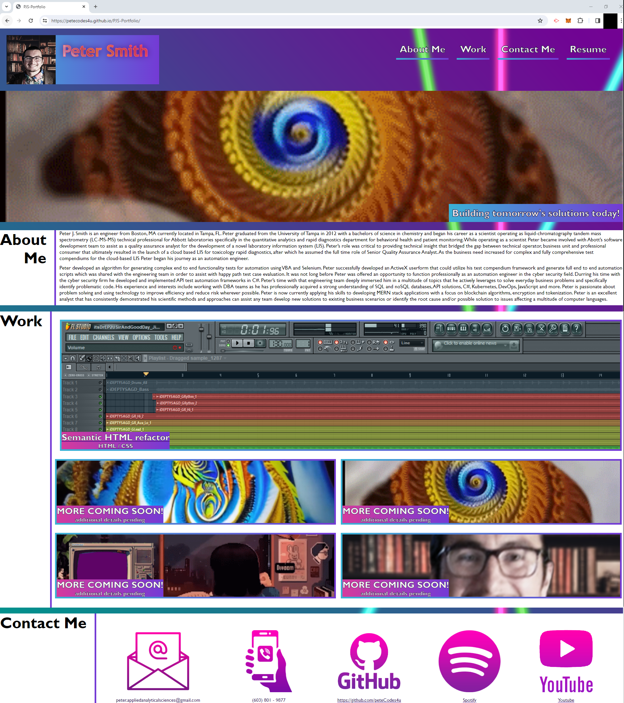

# <Peter J. Smith Portfolio>

## Description

This project has been created to showcase and exercise various web development skills. This poject is engineered to demonstrate responsive design web behaviors using HTML and CSS.   

## Table of Contents

- [Usage](#usage)
- [Credits](#credits)

## Usage

The inteded usage of this webpage is to review information about the engineer Peter J. Smith of Tampa Florida. Please feel free to inspect the webpage and review the CSS and HTML documents to take a look under the hood of this relativly simple project. 

## Credits
I would like to credit Sarah L. Fossheim for her tutorial on adding gradient overlay to text with CSS. The techniques she described were used to produce the gradient border and text effects in this project.

https://fossheim.io/writing/posts/css-text-gradient/

## Features

- Gradient transition animation applied to "Peter Smith" header when page loads or user hovers the cursor over the text.
- Navigation menu items change from white to yellow on user cursor hover.
- Navigation menu link "About Me" is an internal link that returns the user to the "About Me" section of the portfolio.
- Navigation menu link "Work" is an internal link that returns the user to the "Work" section of the portfolio.
- Navigation menu link "Contact Me" is an internal link that returns the user to the "Contact Me" section of the portfolio.
- Navigation menu link "Resume" will trigger a download of Peter's Resume. 
- "Work" section top tile is a link to a live deployed example of Peter's work.
- "Work" section tiles opacity changes when the user hovers the cursor over the individual tiles.
- "Contact Me" section icons highlight in light purple when the user's cursor hovers over the individual icons.
- "Contact Me" section icon for "GitHub" is a hyperlink to Peter's GitHub profile.
- "Contact Me" sections for "Spotify" and "Youtube" are hyperlinks to Peter's art creations for review (Video and Music production) 

## Front End Manual Tests
 
 **Feature - "Peter Smith" header**
 
 **GIVEN :** the webpage loads successfully.
 
 **WHEN :** the page loads OR the user hovers their cursor over the text.
 
 **THEN :** the Gradient transition animation applied to "Peter Smith" will execute, and the user will observe a gradient transition animation.

##

 **Features - Navigation menu items "About Me", "Work", "Contact Me", "Resume"**

 **GIVEN :** the webpage loads successfully.  
 
 **WHEN :** the user hovers their cursor over the text.
 
 **THEN :** the text color will change from white to yellow. 

##

 **Features - Navigation menu items "About Me", "Work", "Contact Me"**

 **GIVEN :** The webpage loads successfully.
 
 **WHEN :** the user clicks on the link text.
 
 **THEN :** the user will be redirected to the respective section of the website "About Me", "Work", "Contact Me".

##

 **Feature - Navigation menu items "Resume"**

 **GIVEN :** The webpage loads successfully.
 
 **WHEN :** the user clicks on the link text.
 
 **THEN :** A download of Peter's resume will execute rendering a .pdf file in the user's downloads folder.

##

 **Feature - "Work" section top tile**

 **GIVEN :** The webpage loads successfully.

 **WHEN :** the user clicks on the top tile anywhere.
 
 **THEN :** the user will be redirected to an example of a live deployed project completed by Peter J. Smith.

##

 **Feature - "Work" section tiles**

 **GIVEN :** The webpage loads successfully.
 
 **WHEN :** the user hovers thier cursor over a tile.
 
 **THEN :** the user will observe the tile opacity change.

##

 **Feature - "Contact Me" section icons** 

 **GIVEN :** The webpage loads successfully.
 
 **WHEN :** the user hovers thier cursor over an icon.
 
 **THEN :** the user will observe the icon highlight in light purple.

##
  **Feature - "Contact Me" section icons "GitHub", "Spotify", "Youtube"**

 **GIVEN :** The webpage loads successfully.
 
 **WHEN :** the user clicks on the icon anywhere.
 
 **THEN :** the user will be redirected to an external respective link associated with the assigned service host.

 

  
